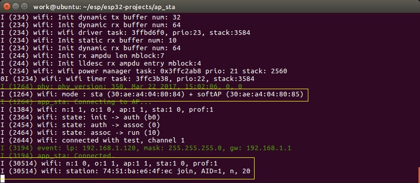

# 让 ESP32 同时扮演 AP+STA 的角色

功能说明：让 ESP32 既当做一个 AP，让其它终端设备访问，又当做一个 STA，连接到其它的 AP。

> 一个有意思的问题，既然是 AP+STA，可不可以让它（作为 STA 角色）连接到它自己（作为 AP 角色）呢？有兴趣的童鞋可以自己取试试^_^

## 快速开始

### 假设

- 你已经安装好 ESP-IDF 和工具链。
- 你已经有一个 WiFi 热点。

### 步骤

- 使用数据线将开发板连接到你的系统中，让系统能够识别到你的板子（Windows 是`COM\*`, Linux 是`/dev/ttyUSB\*`）。
- 进入`ap_sta`所在目录。
- 执行命名`make menuconfig`进行配置。
  - 对串口进行配置。
  - 配置作为 AP 时其它设备访问该 AP 所需要的 SSID 和密码。依次进入配置选项`Demo Configuration  --->`、`AP Configuration  --->`，然后在`[AP] SSID`和`[AP] Password`中填写 SSID 和密码。
  - 配置作为 STA 时需要连接到的 AP 的 SSID 和密码。依次进入配置选项`Demo Configuration  --->`、`STA Configuration  --->`，然后在`[STA] SSID`和`[STA] Password`中填写 SSID 和密码。
- 执行命令`make`进行编译
- 执行命令`make flash monitor`将编译生成的镜像烧写到 ESP32 开发板上面，并查看串口输出。

### 现象

对于 STA 功能，当板子起来后，正如 [让 ESP32 作为 STA 连接的你的 WiFi 热点](https://github.com/tidyjiang8/esp32-projects/tree/master/sta)中的现象一样，板子已经连接到 WiFi 热点，并获取到 IP 地址。

对于 AP 功能，我们在手机中进入 WiFi 设置界面，发现已经能搜索到 ESP32 建立的 AP 了，输入密码后，连接成功。此时我们再看串口的打印消息，它已经打印出了连接到该 AP 的客户端的 MAC 地址。

> 有兴趣的话，查看下你的手机的 MAC 地址，是不是就是 ESP32 所打印的 MAC 地址呢？

## 深入理解

参考博客：
