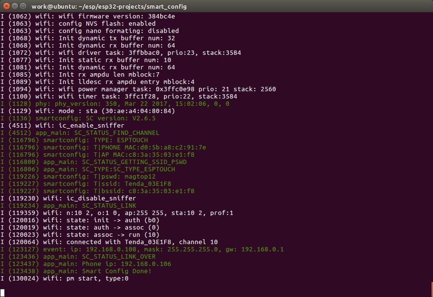

# 用微信/APP 给你的 ESP32 智能配网

功能说明：当 ESP32 作为 STA 或者 APSTA 时，用微信/APP 给它智能配网，让其连接到 WiFi 热点，且不需要蓝牙。

## 快速开始

### 假设

- 你已经安装好 ESP-IDF 和工具链。
- 你已经有一个 WiFi 热点。

### 步骤

- 使用数据线将开发板连接到你的系统中，让系统能够识别到你的板子（Windows 是`COM\*`, Linux 是`/dev/ttyUSB\*`）。
- 进入`smart_config`所在目录。
- 执行命名`make menuconfig`进行配置。
  - 对串口进行配置。
- 执行命令`make`进行编译
- 执行命令`make flash monitor`将编译生成的镜像烧写到 ESP32 开发板上面，并查看串口输出。
- 用手机进行配置（以下两种方式二选一即可）
  - 打开 APP [IoT_Espressif_EspTouch](http://espressif.com/zh-hans/support/download/apks?keys=&field_technology_tid%5B%5D=20)，它会自动识别到手机当前所连接的热点的 SSID，我们只需要输入 Password，然后点击`Confirm`开始配网。
  - 用微信扫描下面的二维码，点击按钮 '配置设备上网'，然后输入手机当前所连接的热点的 Password，然后点击`连接`开始配网。

### 现象

## 深入理解

参考博客：

